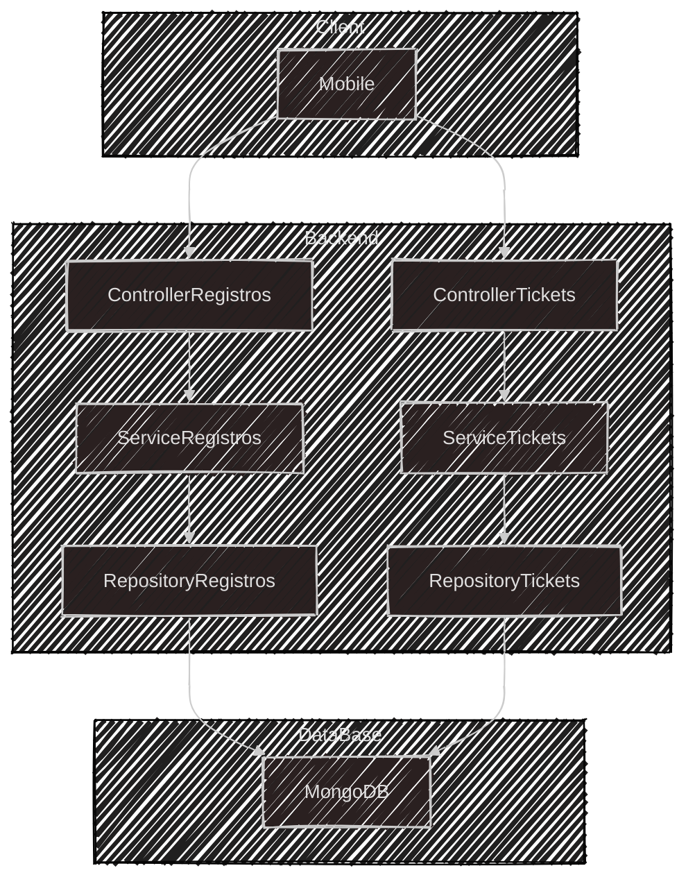

# 📝 Servico de Atendimento

API backend para gerenciamento de registros e tickets, com arquitetura em camadas (Controller, Service, Repository) para separar responsabilidades.

## 🚀 Tecnologias

- **Node.js**, **Express**, **Mongoose**

## 🔧 Como Rodar

1. Clone o repositório.
2. Instale as dependências: `npm install`
3. Inicie: `npm start`

## Desenho de arquitetura simples:

